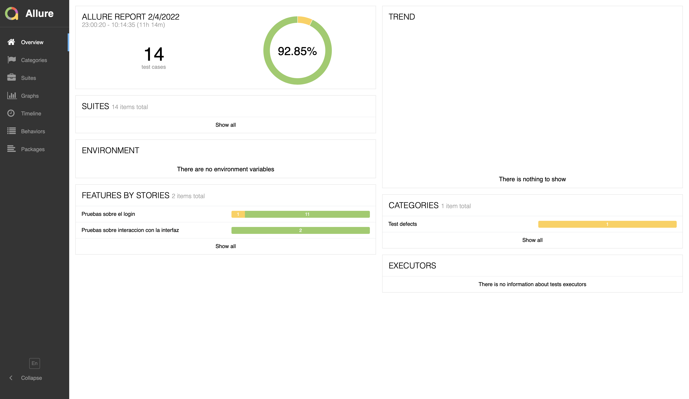
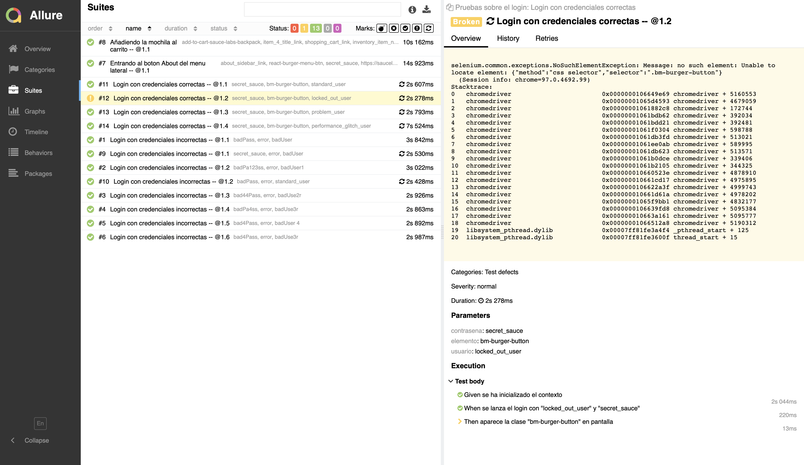

# Profundizacion_Selenium


# Sobre el trabajo

 Dado que a partir del ejercicio 4, todos los restantes son dar vueltas sobre la misma idea me pareció más interesante 
 realizar esos cuatro ejercicios y dedicar el resto del tiempo a introducir tecnologías y librerías muy usadas en testing como son:
 
- Behave
- Allure

## Behave

Este framework es específico para testing y consigue que tengamos unas pruebas que se muestran en lenguaje
natural, por lo que cuando falla alguno de los pasos de la prueba vemos perfectamente qué ha pasado. Además
favorece en gran medida la reutilización de código al definir las Steps y poder invocarlas en numerosos 
escenarios con diferentes parámetros. Por último, destacar que para que un test se ejecute varias veces con 
diferentes valores de entrada es tan simple como meter más filas en la tabla de Examples.

Todos los tests se van creando en la carpeta feature, y la definición de los steps está dentro de la carpeta steps.

Para ejecutar los tests y ver los resultados es tan simple como ejecutar
el comando Behave (he dejado un caso en el que falla para ver cómo aparece):

```
(venv) (base) manuelgonzalezcosta@Manuels-MacBook-Pro selenium % behave

Failing scenarios:
  features/LoginTests.feature:30  Login con credenciales correctas -- @1.2 

1 feature passed, 1 failed, 0 skipped
7 scenarios passed, 1 failed, 0 skipped
32 steps passed, 1 failed, 0 skipped, 0 undefined
Took 0m29.604s

```

Como vemos, no es necesario un main.py ni nada por el estilo, Behave lo hace todo por nosotros.

## Allure

Allure crea con una página HTML donde muestra de manera gráfica el resultado de todos los tests. 
Es muy visual y se utiliza mucho para enviar los resultados a personas que no estén familiarizadas
con el mundo del testing pero que necesiten saber cómo de probado está el software.

Para genererar y luego visualizar los reportes se ejecutarán los dos comandos siguientes:
```
# Para que behave genere unos json con los resultados y los almacene en una carpeta
behave -f allure_behave.formatter::AllureFormatter -o reports/ features

# Para que allure genere una web con los resultados
allure serve reports/          
```

Se muestra un ejemplo del resultado a continuación:


